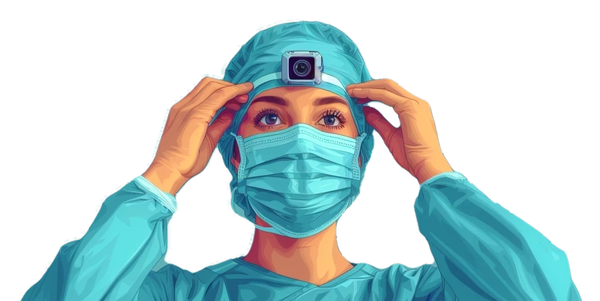

# Welcome

**Elevate Your Medical Practice**\
\
Whether you're looking to refine your skills, start with essential basics, or dive deep into our innovative Neoflix program, you've come to the right place. Our documentation is tailored to help healthcare professionals, educators, and administrators enhance their impact in medical settings through continuous learning and effective practices.

<table data-view="cards"><thead><tr><th></th><th></th><th></th><th data-hidden data-card-target data-type="content-ref"></th></tr></thead><tbody><tr><td></td><td>
<mark style="color:blue;"><strong>Who is this for?</strong></mark>

Curious if this is for you? This section is designed to help you quickly determine whether the content will serve your needs.
</td><td></td><td><a href="welcome/who-is-this-for.md">who-is-this-for.md</a></td></tr><tr><td></td><td>
<mark style="color:blue;"><strong>Quick-start</strong></mark>

Ready to jump right in? Our Quick-start guide is here to help you hit the ground running
</td><td></td><td><a href="welcome/quick-start/">quick-start</a></td></tr><tr><td></td><td>
<mark style="color:blue;"><strong>Neoflix</strong></mark>

Welcome to Neoflix, where we transform medical practice through the power of video review and continuous learning.
</td><td></td><td><a href="welcome/neoflix/">neoflix</a></td></tr></tbody></table>

The KNAW Van Walree Fund supported the development of this website.&#x20;

<figure><figcaption></figcaption></figure>
