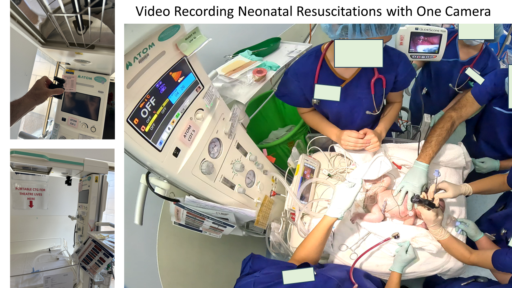

# NICU in Melbourne, Australia

## Neonatal Intensive Care Unit (NICU) of the Ritchie Centre, Monash University

**Type of recording**

* Fixed cameras recording neonatal stabilization
* Infant is visible, hands and arms of providers, voice clearly audible.
* Equipment: GoPro camera (full room-view of delivery room), including view of respiratory parameters through a wide-angle lens (removable attachment), fixed to resuscitator using magnets.
* Challenge: overheating of camera

**Patient Consent**

* Waiver of parental consent to use for educational and quality assurance activities at Monash Health since 2019. Researchers are obligated to keep the videos in a password-protected secure location for 7 years in accordance with Victoria, Australia standards.
* If researchers want to use the data for research, they have submitted additional ethics applications.
* If researchers want to use individual videos for conferences, cases, or publications, they have used their hospital's standardized case report form to discuss with parents for consent.

**Provider Consent**

* Verbal acknowledgement prior to videoing and a more formal verbal (or email/text) consent prior to using for reviewing is obtained.
* Review sessions tend to be at junior doctor learning sessions or nursing in-services, which are separate. Typically, they will seek the permission of the fellow managing the airway and the nurse in charge of the monitoring.
* They have standing consent from all consultants and get permission from other providers who may have made contact with the baby as needed, depending on their level of involvement.

**Review use**

* This center has had 64 formal learning sessions on record with a sign-in sheet that also doubles as consent for the rules of participation in a video review session: Everyone in the room and on the video is smart, well-trained, trying their best, wants to improve, and everything in the session is confidential.
* In the last 4.5 years (since starting in Sept 2019 through Jan 2024), they have recorded 108 resuscitations. 37 videos have been formally reviewed. This center has run 64 total formal sessions, 37 for junior doctors, 9 for RNs, 8 for mixed groups (junior doctors and consultants, multiple disciplinary QI groups), and 10 private 1:1 coaching sessions, totaling 408 participants.
* In August 2020, they added NRVR to the Monash Health Advanced NeoResus training as a 45-minute video featuring highlights from their video review program. NeoResus is a national Neonatal Resuscitation training program in Australia, similar to NRP. This 45-minute review has been seen in the 16 subsequent advanced NeoResus training days, with an estimated 380 students.

**Usage**

* Staff education and as an adaptation to a nationally recognized Neonatal Resuscitation training project for Monash Health staff.
* Occasional review by relevant working groups.
* Researchers are running a project in 2024 to study the benefits of 1:1 junior doctor coaching and 1:1 RN coaching.
* NRVR can also be used as standard data available for neonatal resuscitation research projects, as available.

**Storage**

* Recordings are managed as an ethics-approved QA project, with an obligation to maintain records and videos for 7 years per state standards.
* Recordings are not part of the medical record of the patient.
* Stored digitally in a password-protected, secure location. Researchers attempt to de-identify files by using a QA project number.

**Pros**

* Critical Event Capture: Enables recording of urgent procedures where obtaining immediate consent from patients is impractical.
* Provider Autonomy: Respects providers' choice to participate or not.
* One camera: Through the wide-angle lens, researchers only require one camera to obtain a view of the procedure and the respiratory parameters.

**Cons**

* Patient Privacy Concerns: The infant is visible in recordings, and family can be visible.
* Recordings are not part of the medical record of the patient and/or shared with parents.

**If you have any questions, regarding this approach, feel free to contact this experienced center at** [doug.blank@monash.edu](mailto:doug.blank@monash.edu)\
\
.png>).png>)
